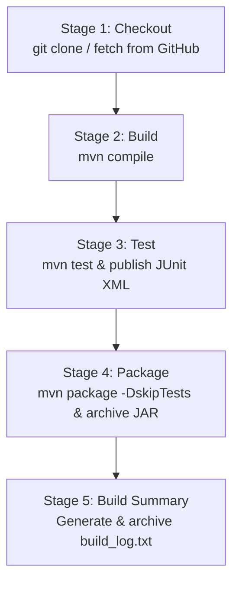

# CampusCart – Online College Stationery Store

> **Phase 1: Core Application Foundation**  
> A lightweight, beginner-friendly online college stationery store application designed for academic demonstrations and Software Engineering / DevOps lab curriculum.

---

## 📌 Project Overview & Problem Statement

College students frequently need stationery supplies—such as exam-ruled notebooks, blue/black pens, engineering drawing sheets, lab record folders, calculators, and ID card holders—often on short notice during lecture breaks or late-night assignment submissions. Campus stationery shops frequently face peak-hour queues, out-of-stock items, and fragmented order tracking.

**CampusCart** solves this campus challenge by providing an accessible, responsive web store tailored to college students. Students can browse the campus stationery catalog, filter by academic categories, assemble a cart, and place immediate hostel-delivery or counter-pickup orders without navigating complex external payment gateways or third-party sign-ups.

---

## 🎯 Objectives

1. **Simplicity & Explainability:** Built cleanly using simple Java 17 + Spring Boot and vanilla HTML/CSS/JavaScript so that a 2nd-year engineering student can easily understand, modify, and present the architecture.
2. **Unified Single-Artifact Deployment:** The frontend assets reside directly in `src/main/resources/static/`, enabling the entire application to build into a single self-contained JAR file suitable for simple Dockerization.
3. **Foundation for DevOps Experiments:** Architected to serve as the baseline application for an upcoming 10-stage DevOps and Software Engineering pipeline.

---

## ✨ Main Features

* **Stationery Catalog Browsing:** Browse essential college supplies (notebooks, pens, folders, drafting sheets, scientific calculators, highlighters).
* **Category Filtering:** Filter by academic categories (*Notebooks*, *Pens & Pencils*, *Folders & Organizers*, *Electronics*, *Exam & Drafting*, *Accessories*).
* **Dynamic Cart Management:**
  * Add products with visual confirmation feedback.
  * Live cart item count badge in navigation.
  * Adjust quantities (`+` / `−`) and remove items.
  * Instant subtotal and grand total calculation.
* **Campus Checkout:**
  * Simple student input form (Name, Roll Number / Student ID, College Email, Hostel & Room Number).
  * Campus delivery options (*Cash on Delivery*, *UPI on Delivery*, *Pay at Counter*).
* **Order Confirmation & Tracking:**
  * Generates a unique order identifier (e.g., `CC-1001`).
  * Instant confirmation modal displaying delivery location and summary.
  * Built-in "Track Order" lookup by Order ID.

---

## 🛠️ Technology Stack

| Layer | Technology | Details |
| :--- | :--- | :--- |
| **Backend** | Java 17+ / Spring Boot 3.3.4 | RESTful APIs, Spring Web, Jakarta Validation |
| **Data Store** | In-Memory Repositories | `ConcurrentHashMap` with pre-loaded college catalog (zero DB setup required) |
| **Frontend** | HTML5, CSS3, Vanilla JavaScript | Responsive flex/grid design, SVG stationery icons, zero heavy UI frameworks |
| **Build Tool** | Apache Maven 3.9+ | Standard Maven layout with JUnit 5 & Spring MockMvc testing |
| **Testing** | JUnit 5, Spring Boot Test & Selenium | Automated unit, integration, and E2E browser tests |

---

## 📂 Project Structure

```text
CampusCart/
├── .gitignore
├── pom.xml
├── README.md
└── src/
    ├── main/
    │   ├── java/
    │   │   └── com/
    │   │       └── campuscart/
    │   │           ├── CampusCartApplication.java
    │   │           ├── controller/
    │   │           │   ├── OrderController.java
    │   │           │   └── ProductController.java
    │   │           ├── dto/
    │   │           │   ├── CartItemDto.java
    │   │           │   └── OrderRequest.java
    │   │           ├── model/
    │   │           │   ├── Order.java
    │   │           │   ├── OrderItem.java
    │   │           │   └── Product.java
    │   │           ├── repository/
    │   │           │   ├── OrderRepository.java
    │   │           │   └── ProductRepository.java
    │   │           └── service/
    │   │               ├── OrderService.java
    │   │               └── ProductService.java
    │   └── resources/
    │       ├── application.properties
    │       └── static/
    │           ├── css/
    │           │   └── styles.css
    │           ├── js/
    │           │   └── app.js
    │           └── index.html
    └── test/
        └── java/
            └── com/
                └── campuscart/
                    ├── CampusCartApplicationTests.java
                    ├── CampusCartSeleniumTest.java
                    ├── controller/
                    │   ├── OrderControllerTest.java
                    │   └── ProductControllerTest.java
                    └── service/
                        └── OrderServiceTest.java
```

---

## 🚀 How to Run Locally

### Prerequisites
* **Java 17** or newer installed (`java -version`)
* **Maven 3.8+** installed (`mvn -version`)

### 1. Clone the Repository
```bash
git clone https://github.com/Parth9P/CampusCart.git
cd CampusCart
```

### 2. Build and Run Tests
```bash
mvn clean test
```

### 3. Run the Spring Boot Application
```bash
mvn spring-boot:run
```

### 4. Open in Browser
Open your browser and navigate to:
```text
http://localhost:8080/
```

---

## 🔌 Basic API Reference

| Method | Endpoint | Description |
| :--- | :--- | :--- |
| `GET` | `/api/products` | Retrieve all stationery products |
| `GET` | `/api/products/{id}` | Retrieve single product details by ID |
| `GET` | `/api/products/category/{category}` | Filter stationery products by category |
| `POST` | `/api/orders` | Place a new order with cart items and student details |
| `GET` | `/api/orders/{orderId}` | Lookup order status and items by Order ID (e.g., `CC-1001`) |
| `GET` | `/api/orders` | List all recent orders |

### Sample Order Payload (`POST /api/orders`)
```json
{
  "customerName": "Rahul Sharma",
  "studentId": "22BCE1042",
  "email": "rahul.sharma@college.edu",
  "hostelRoom": "Hostel C, Room 204",
  "paymentMethod": "Cash on Delivery",
  "items": [
    { "productId": 1, "quantity": 2 },
    { "productId": 2, "quantity": 3 }
  ]
}
```

---

## 📊 Current Implementation Status (Phase 1)

* [x] Core Spring Boot backend architecture initialized
* [x] In-memory product catalog with 10 essential stationery items
* [x] In-memory order management with ID generation (`CC-1001`, `CC-1002`, ...)
* [x] REST API endpoints for catalog and orders
* [x] Responsive student store interface (Catalog, Cart Drawer, Checkout Modal, Order Confirmation, Order Tracking)
* [x] Automated unit and integration tests passing (`10/10 tests passed`)
* [x] Maven build and clean execution verified locally

---

## 🗺️ Future DevOps Integration Roadmap

This application foundation will serve as the subject for the following upcoming lab experiments:

```text
Jira (Agile) ──> Git / GitHub ──> Jenkins CI ──> SonarQube (Quality Gate)
                                       │
                                       ▼
Docker Container ──> Docker Hub ──> Kubernetes Cluster
                                       │
                                       ▼
Ansible Configuration ──> Terraform Infrastructure ──> Selenium Automated Tests
```

1. **Jira:** Agile user stories, backlog grooming, and sprint tracking.
2. **Git/GitHub:** Feature branching, pull requests, and commit conventions.
3. **Jenkins CI:** Automated build, test triggers, and artifact archiving.
4. **SonarQube:** Static code analysis, security scanning, and code coverage gates.
5. **Docker:** Containerizing the packaged Spring Boot application (`Dockerfile`).
6. **Docker Hub:** Automated image push and version tagging.
7. **Kubernetes:** Deployments, Services, ConfigMaps, and Pod scaling.
8. **Ansible:** Automated server setup and configuration management.
9. **Terraform:** Cloud infrastructure provisioning (IaC).
10. **Selenium:** Automated browser end-to-end testing for the purchase workflow.

*(Note: The DevOps stages listed above will be implemented incrementally in subsequent phases).*

---

## 🏗️ Jenkins CI (Continuous Integration Pipeline)

CampusCart includes a production-ready, root-level declarative [`Jenkinsfile`](file:///Jenkinsfile) configured for automated Continuous Integration (CI).

### 1. Prerequisites on Jenkins
* **Jenkins 2.x+** with standard plugins installed (**Pipeline**, **Git**, and **JUnit**).
* **JDK 17+** and **Apache Maven 3.8+** installed on the Jenkins controller or build agent and available in the system PATH.

### 2. How to Create the Pipeline Job in Jenkins
1. From the Jenkins Dashboard, click **New Item**.
2. Enter item name: `CampusCart-CI`.
3. Select **Pipeline** as the project type and click **OK**.
4. In the job configuration page, scroll down to the **Pipeline** section:
   * **Definition:** Select `Pipeline script from SCM`.
   * **SCM:** Select `Git`.
   * **Repository URL:** `https://github.com/Parth9P/CampusCart.git`
   * **Credentials:** Leave blank (for public repository) or select configured Jenkins credentials.
   * **Branch Specifier:** `*/main`
   * **Script Path:** `Jenkinsfile`
5. Click **Save**.

### 3. How Jenkins Connects to the Repository
Jenkins automatically fetches the source code using the standard SCM plugin. Credentials, if needed, are managed entirely through the Jenkins Credentials store (`Credentials ID`), ensuring that **no passwords, tokens, or private keys are ever stored inside the repository or the Jenkinsfile**.

### 4. What the Pipeline Stages Do

```text
┌────────────┐     ┌───────────┐     ┌───────────┐     ┌──────────────┐     ┌─────────────────┐
│  Checkout  │ ──> │   Build   │ ──> │   Test    │ ──> │   Package    │ ──> │  Build Summary  │
│  (Git SCM) │     │ (Compile) │     │  (JUnit)  │     │ (Spring JAR) │     │ (build_log.txt) │
└────────────┘     └───────────┘     └───────────┘     └──────────────┘     └─────────────────┘
```

1. **Checkout:** Clones the latest code commit from the `main` branch of `https://github.com/Parth9P/CampusCart.git`.
2. **Build:** Runs `mvn compile` (cross-platform compatible via `sh` or `bat`) to verify that all Java source code compiles cleanly.
3. **Test:** Executes automated unit and integration tests with `mvn test`. The build immediately stops and fails if any test fails. The `junit` post-action parses Surefire XML reports (`target/surefire-reports/*.xml`).
4. **Package:** Runs `mvn package -DskipTests` to package the compiled application and static frontend into an executable JAR. Archives `target/campuscart-1.0.0.jar` as a Jenkins artifact.
5. **Build Summary:** Dynamically queries the build environment (Java version, Maven version, commit hash, build status) and writes `build_log.txt`, archiving it for auditing and verification.

### 5. Viewing Test Reports and Artifacts
* **Test Results:** Click on **Test Result** in the left sidebar of any build to view individual test outcomes and stack traces. A **Test Result Trend** graph automatically visualizes test health over successive builds.
* **Build Artifacts:** Under the **Build Artifacts** section on the build page, you can directly download:
  * `target/campuscart-1.0.0.jar` (Executable Spring Boot JAR)
  * `build_log.txt` (Build metadata and status log)

### 6. Triggering a Build Manually
To trigger a build for a lab demonstration:
1. Open the `CampusCart-CI` job in Jenkins.
2. Click **Build Now** in the left menu.
3. Click on the active build number (e.g. `#1`) and select **Console Output** to observe live step-by-step stage execution.

---

## 🧪 Selenium Test Automation

### 1. Purpose of Selenium Testing
Selenium WebDriver provides automated browser-based End-to-End (E2E) testing. While unit tests and MockMvc integration tests verify business logic and API contracts in isolation, Selenium validates the actual user experience in a real browser engine—ensuring that dynamic DOM manipulation, JavaScript event listeners, asynchronous API fetches, slide-out drawer animations, modal dialogs, and local storage state behave correctly from an end student's perspective.

### 2. Selenium Dependency
The project uses `selenium-java` version `4.25.0` configured in [`pom.xml`](pom.xml) under the `<scope>test</scope>`:
```xml
<dependency>
    <groupId>org.seleniumhq.selenium</groupId>
    <artifactId>selenium-java</artifactId>
    <version>4.25.0</version>
    <scope>test</scope>
</dependency>
```
With Selenium 4.6+, **Selenium Manager** is built-in and automatically detects the local browser (e.g. Google Chrome or Microsoft Edge) and provisions the exact matching driver binary in the background, eliminating any need to manually download or configure `chromedriver.exe` in the system PATH.

### 3. Browser Requirement
* **Google Chrome** (or Chromium) installed on the host machine.
* Tests run by default in headless mode (`--headless=new`, `--no-sandbox`, `--disable-dev-shm-usage`) to execute cleanly on both local developer workstations and headless CI build machines without requiring a display server.

### 4. How to Start CampusCart & Run Tests
There are two supported workflows:

#### Workflow A: Standard Two-Terminal Workflow (Recommended for Lab Demonstrations & Viva)
1. **Terminal 1 — Start the Application:**
   ```bash
   mvn spring-boot:run
   ```
   Wait until you see: `Tomcat started on port 8080 (http)`.
2. **Terminal 2 — Run the Selenium E2E Suite:**
   ```bash
   mvn test -Dtest=CampusCartSeleniumTest
   ```

#### Workflow B: Automated Standalone Execution
Run the entire automated test suite directly without starting a background server manually. The test class automatically boots an embedded Spring Boot instance on port `8080` if none is detected, executes all browser and unit tests, and terminates cleanly:
```bash
mvn clean test
```

### 5. Scenarios Tested
The test class [`CampusCartSeleniumTest.java`](src/test/java/com/campuscart/CampusCartSeleniumTest.java) executes 4 core student user journeys:

| Test ID | Test Method | Scenario Description | Expected Outcome |
| :--- | :--- | :--- | :--- |
| **Test 1** | `testHomepageLoadsAndBrandingVisible` | Navigate to `http://localhost:8080/` | Page title contains `CampusCart`, navbar displays brand logo & text, hero banner and stationery catalog product cards render. |
| **Test 2** | `testProductAddToCartUpdatesBadge` | Locate product (*Spiral Notebook*) and click `+ Add to Cart` | Button triggers visual feedback and navbar cart badge count increments from `0` to `1`. |
| **Test 3** | `testCartDrawerDisplaysItemDetailsAndTotal` | Add item, open slide-out cart drawer | Cart drawer opens, shows item name (*Spiral Notebook*), unit price, quantity (`1`), subtotal (`₹60.00`), and grand total (`₹60.00`). |
| **Test 4** | `testCheckoutAndOrderConfirmationFlow` | Add item, open drawer, proceed to checkout, enter student details, submit order | Checkout modal opens, form inputs accept student details, `POST /api/orders` succeeds, confirmation modal displays sequential Order ID (e.g., `CC-1001`), customer name, and total. |

### 6. Test Isolation & Reliability
* **Predictable State:** Each test runs `@BeforeEach` which navigates to `http://localhost:8080/`, clears browser `localStorage` (`localStorage.clear()`), refreshes the page, and waits for dynamic product cards to load.
* **Explicit Waits:** All interactions use `WebDriverWait` with `ExpectedConditions` to accommodate asynchronous REST API calls and CSS slide/fade animations without arbitrary thread sleeps.

### 7. Environment Limitations & Notes
* If running on a minimal Linux headless server (such as Docker or minimal VM), Chrome and its dependent libraries (`libnss3`, `libgconf-2-4`, etc.) must be installed.
* On Windows workstations with Google Chrome installed, Selenium Manager seamlessly manages driver downloads and headless execution out of the box.

---

## 🚀 Jenkins CI Demonstration

### 1. Overview & Objective
CampusCart includes an automated, declarative Continuous Integration (CI) pipeline configured via [`Jenkinsfile`](Jenkinsfile). The pipeline ensures that every commit pushed to GitHub is automatically checked out, built with Maven, thoroughly tested, and packaged into an executable Spring Boot artifact with archived build logs and JUnit reports.

### 2. Jenkins Architecture & Port Allocation
* **CampusCart Web Application:** Runs on port `8080` (`http://localhost:8080/`).
* **Jenkins Controller:** Runs on port `8081` (`http://localhost:8081/`) to prevent port conflicts with the running web application or automated tests.
* **Environment:** Completely standalone execution on Windows without Docker or Kubernetes.

### 3. Step-by-Step Jenkins Setup (Beginner-Friendly)
To run Jenkins on Windows without complex installers:

1. **Download Jenkins Standalone WAR:**
   Download the official Jenkins LTS `.war` file from:
   [https://get.jenkins.io/war-stable/latest/jenkins.war](https://get.jenkins.io/war-stable/latest/jenkins.war)
   Place `jenkins.war` into a local directory (e.g., `C:\Jenkins\` or `C:\Users\<user>\AppData\Local\Programs\Jenkins\`).

2. **Start the Jenkins Server:**
   Open PowerShell or Command Prompt and run:
   ```bash
   java -Djenkins.enableFutureJava=true -jar jenkins.war --httpPort=8081
   ```
   *(Note: `-Djenkins.enableFutureJava=true` ensures compatibility across modern Java runtimes).*

3. **Unlock Jenkins:**
   * Open your browser and navigate to: `http://localhost:8081/`
   * Copy the initial administrator password from the console or file:
     `C:\Users\<YourUsername>\.jenkins\secrets\initialAdminPassword`
   * Paste the password and click **Continue**.

4. **Install Plugins:**
   * Select **"Install suggested plugins"** (installs Pipeline, Git, JUnit, and Workspace plugins).
   * Create your first Admin User credentials and complete the wizard.

### 4. Creating the CampusCart Pipeline Job
1. From the Jenkins Dashboard, click **New Item**.
2. Enter item name: `CampusCart-Pipeline`.
3. Select **Pipeline** as the project type and click **OK**.
4. Scroll down to the **Pipeline** configuration section:
   * **Definition:** Select `Pipeline script from SCM`.
   * **SCM:** Select `Git`.
   * **Repository URL:** `https://github.com/Shravanikam-1787/CampusCart.git`
   * **Credentials:** Leave `- none -` (public repository).
   * **Branch Specifier:** `*/main`.
   * **Script Path:** `Jenkinsfile`.
5. Click **Save**.

### 5. Executing the Pipeline
1. On the `CampusCart-Pipeline` project page, click **Build Now** in the left sidebar.
2. Monitor progress in the **Stage View** or click the build number (e.g., `#1`) -> **Console Output**.

### 6. Pipeline Stages Explained



* **Stage 1: Checkout:** Clones source code and history from `https://github.com/Shravanikam-1787/CampusCart.git` on branch `main`.
* **Stage 2: Build:** Validates project structure and compiles all Java source classes with `mvn compile`.
* **Stage 3: Test:** Executes automated unit and integration tests with `mvn test`, publishing Surefire XML test reports.
* **Stage 4: Package:** Packages compiled classes and resources into `target/campuscart-1.0.0.jar` and archives the artifact in Jenkins.
* **Stage 5: Build Summary:** Generates a clean text summary (`build_log.txt`) containing build number, commit hash, environment versions, and status.

### 7. Verifying Results & Viva Q&A
* **Viewing Test Reports:** Click the build number -> **Test Result** to inspect individual JUnit assertions and execution times.
* **Downloading the Artifact:** Click the build number -> **Build Artifacts** -> download `campuscart-1.0.0.jar`.
* **Build Summary:** Under **Build Artifacts**, view `build_log.txt` for an instant audit trail.
* **Interpreting Status:**
  * 🟢 **SUCCESS:** All stages passed, unit tests succeeded, and the JAR was archived.
  * 🔴 **FAILURE:** Any compiler error, test assertion failure, or syntax issue halts the pipeline immediately and highlights the failed stage in red.


